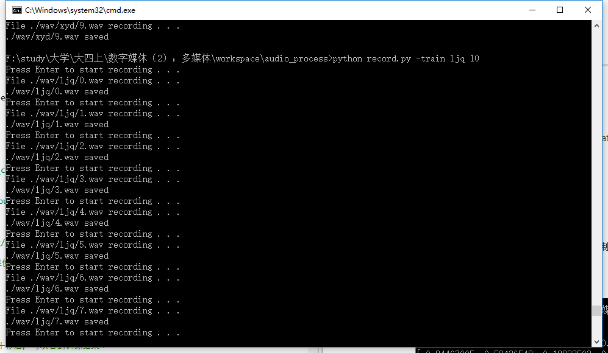
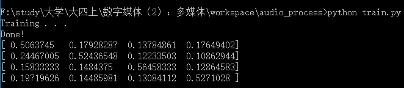
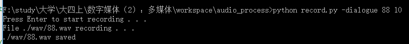

# 音频处理实验报告

王昭 | 周立旺

***

### 一、实验环境
* Windows 10
* python 2.7.11
	* 需要numpy、pyaudio、sklearn、pycurl、python\_speech_features库
* 连接互联网

### 二、使用说明
1. 录制训练音频，在控制台中运行：

	```
	python record.py -train [author_name] [repeat_count]
	```

	其中author\_name代表录制音频的人的代称，repeat\_count代表录制音频次数。运行上述指令后，将会进行若干次需要单击回车开始的录音操作，录音将会持续5秒。

	比如：
	<div style="text-align: center;"></div>

	或者可以使用我提前录制好的录音，存储在./wav/下，如果使用之，则不必执行此操作。

2. 训练模型，在控制台中运行：

	```
	python train.py
	```

	该指令会对./wav/下所有author的音频进行训练，稍等几十秒后，可以看到训练结果：
	<div style="text-align: center;"></div>
	上图所示的四个向量分别表示小型测试音频的预测结果，每个向量的四个值分别表示这段音频属于对应人的概率。

3. 录制对话音频，在控制台中运行：

	```
	python record.py -dialogue [audio_name] [last_time]
	```
	
	比如：
	<div style="text-align: center;"></div>
	其中audio\_name代表录制音频的文件名（不包括后缀，默认存储在./wav/下），last\_time代表音频的持续时间。为保证预测效果，不同人说话间隔应该约半秒，并且尽量吐字清楚。

4. 话者识别及speech2text，在控制台中运行：

	```
	python stt.py [audio_name]
	```

	比如：
	<div style="text-align: center;"></div>
	由于网络及api原因，speech2text的过程持续时间较久，请耐心等候。

### 三、实现方法
1. 数据采集

	采用16000Hz的采样率，位深度为16.

2. 特征提取

	首先对音频分帧，每帧为256个采样点。对每帧求MFCC特征，得到长度为13的特征向量。

3. 话者识别

	使用sklearn的随机森林分类器，可以得到概率输出。对于一段音频，首先对其进行分帧，再计算每个帧属于某个话者的概率，取所有概率的均值来判断话者身份。

4. 语音分段

	求每帧各个采样点音频幅值的均值作为该帧的平均音量，首先取出所有音量大于3的帧，之后将距离较近的区间进行合并，从而得到几大段音频。

5. speech2text

	采用百度语音api，post至其服务器得到text。